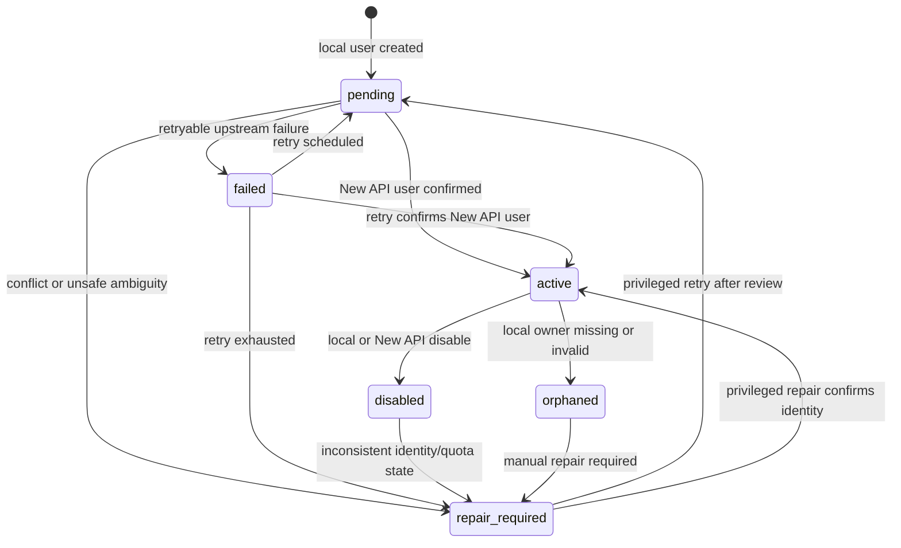

# User Sync State Machine

## States



## Status Semantics

| Status | Meaning | Billable cloud action |
| --- | --- | --- |
| `pending` | Local user exists and New API sync has not completed. | Blocked. |
| `active` | Local user maps to a confirmed enabled New API user. | Allowed by later B10 quota gate. |
| `failed` | Last sync failed but can be retried. | Blocked. |
| `disabled` | Local or New API user is disabled. | Blocked. |
| `orphaned` | Mapping no longer has a safe local owner relationship. | Blocked. |
| `repair_required` | Automatic retry is unsafe or retry limit is exhausted. | Blocked. |

## Idempotency

The idempotency key should be derived from the local registration or provisioning operation, for example:

```text
register:<local_user_id>:<registration_request_id>
```

Rules:

- repeated local registration sync attempts reuse the existing pending/failed/active mapping;
- repeated upstream 409 responses trigger lookup/confirmation before repair;
- timeout after create triggers lookup/confirmation before retry;
- no automatic deletion is allowed for an upstream user whose ownership cannot be confirmed.

## Retry Policy

Default retry ceiling is three attempts.

Retryable:

- New API timeout
- New API network failure
- retryable 429/5xx errors reported by the B07 client

Not retryable without review:

- admin authorization/config failure
- duplicate upstream user that cannot be confirmed by username or email
- local uniqueness conflict
- stale version after another transition changed the row
- retry count exhausted

Backoff is not scheduled by a background worker in B08 because the project does not yet have a job runner. B09/B10 may call `prepareRetry` from an explicit repair or retry path.

## Compensation Rules

| Scenario | B08 behavior |
| --- | --- |
| First sync succeeds | Mark mapping `active` with `new_api_user_id`. |
| Mapping already exists and active | Return it without creating another New API user. |
| Duplicate request while pending | Reuse the same mapping row. |
| Same username/email exists upstream | Link only after list/query confirms the matching user. |
| New API create succeeds, local activation fails | Keep local mapping out of `active`; schedule repair. |
| Local pending exists, New API create fails | Mark `failed` when retryable, otherwise `repair_required`. |
| Timeout but upstream actually created user | Query users and activate if confirmed. |
| User disabled | Mark `disabled`; billable actions remain blocked. |
| User deleted or owner missing | Mark `orphaned`; manual repair required. |
| Concurrent create | Repository serializes local writes and uses `version` to reject stale transitions. |
| Retry reaches max | Mark `repair_required`. |

## Audit Requirements

Later modules must write a product audit log for:

- mapping created
- mapping activated
- sync failed
- retry scheduled
- disabled/orphaned state
- repair entered
- privileged repair completed

Audit logs must use sanitized error codes and messages only. They must not include passwords, cookies, Authorization headers, New API admin tokens, API keys, webhook secrets, or payment secrets.
